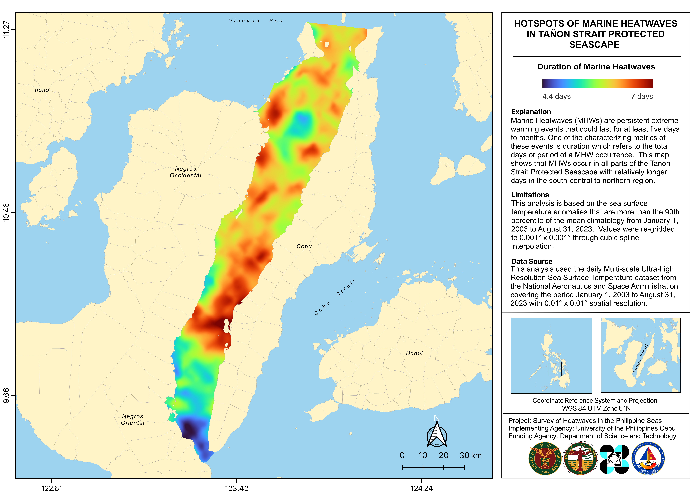
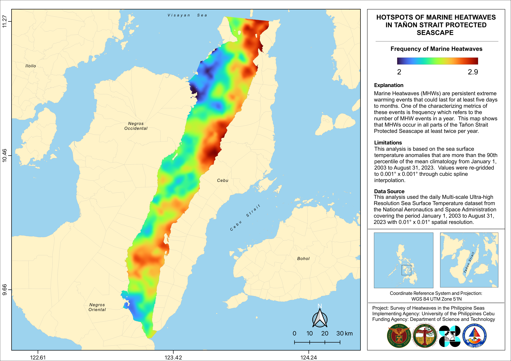
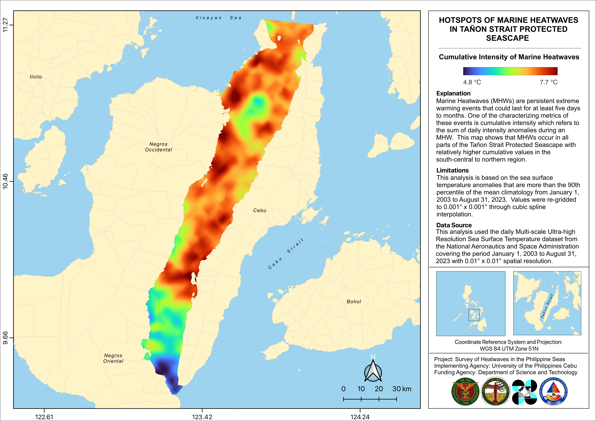
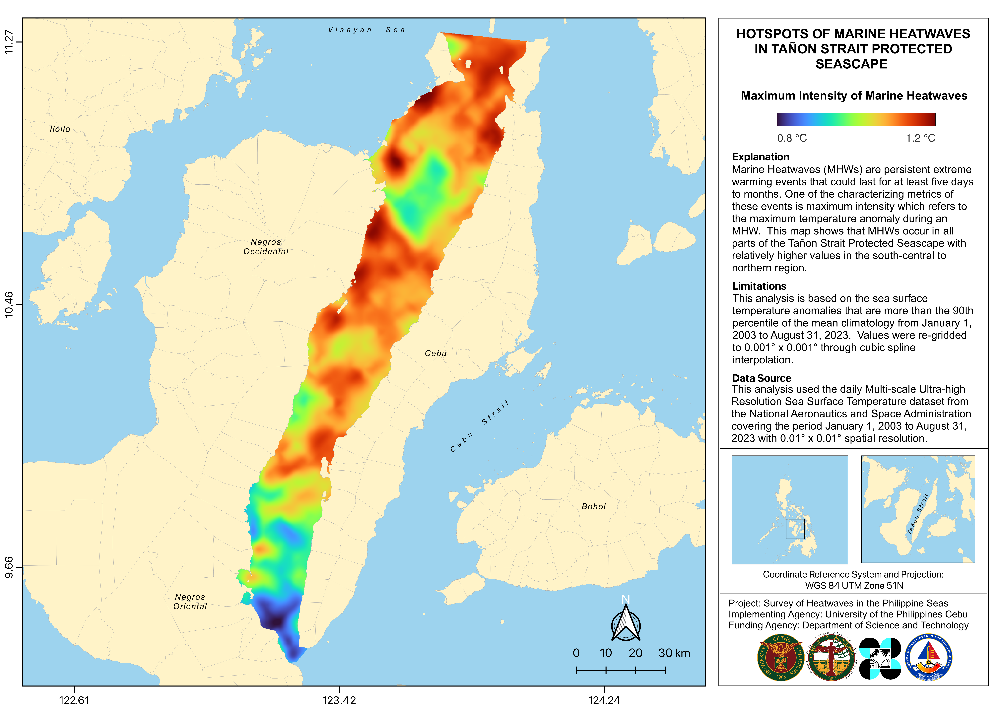
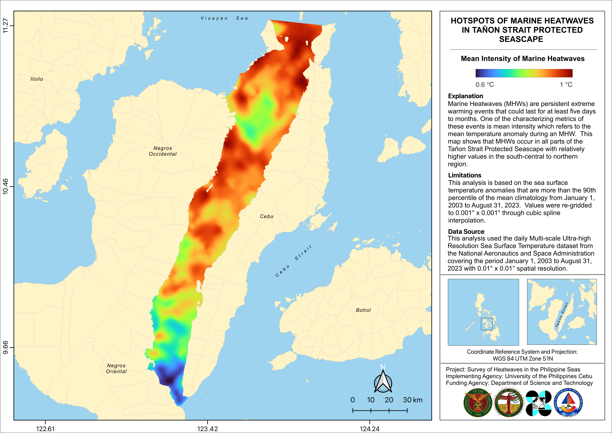

# Marine Heatwaves Hotspots within Tañon Strait Protected Seascape (TSPS)

This repository hosts maps depicting the hotspots of various metrics of marine heatwaves within the Tañon Strait Protected Seascape (TSPS).

## Description

| Metrics              | Description                               | Image Filename |
|-------------------|-----------------------------------|------------------|
| Duration             | Total days or period of a MHW occurrence  | duration.png   |
| Frequency            | Number of MHW events in a year            | frequency.png  |
| Cumulative Intensity | Sum of the daily anomalies during an MHW  | icum.png       |
| Maximum Intensity    | Maximum temperature anomaly during an MHW | imax.png       |
| Mean Intensity       | Mean temperature anomaly during an MHW    | imean.png      |

## Limitations

The analysis is based on the sea surface temperature anomalies that are more than the 90th percentile of the mean climatology from January 1, 2003 to August 31, 2023 . Values were re-gridded through spline interpolation.

## Data Source

The analysis used the daily Multi-scale Ultra-high Resolution Sea Surface Temperature dataset from the National Aeronautics and Space Administration covering the period January 1, 2003 to August 31, 2023 with 0.001° x 0.001° spatial resolution.

## Acknowledgement

These maps are outputs of the project SHIPS (Survey of Heatwaves in the Philippine Seas) implemented by University of the Philippines Cebu. This project was funded by Department of Science and Technology (DOST) - Philippine Council for Industry, Energy, and Emerging Technology Research and Development (PCIEERD).

